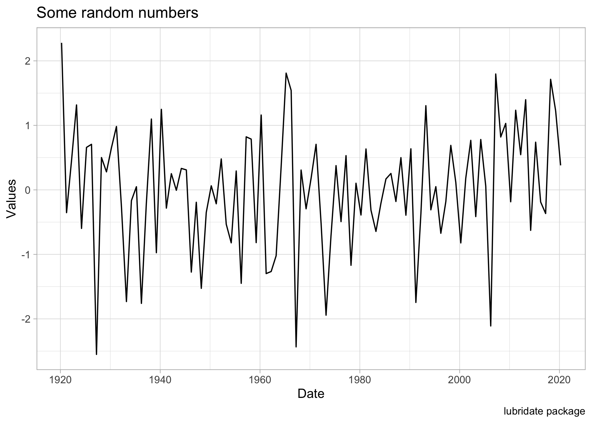

```r
knitr::opts_chunk$set(message = FALSE, warning=FALSE, echo = TRUE, cache = F, dpi=300)
```

# Getting Time Components
This package makes it easier  to work  with dates etc in   `R`. Here how it goes:


```r
library(tidyverse)
library(lubridate)
```


```r
rm(list = ls())
graphics.off()

dt1 <- ymd("2020-03-25") # or today()
# Pick the components (years, months, days) from it
year(dt1)
```

```
## [1] 2020
```

```r
month(dt1)
```

```
## [1] 3
```

```r
day(dt1)
```

```
## [1] 25
```

```r
quarter(dt1)
```

```
## [1] 1
```

```r
yday(dt1) # Day of the year
```

```
## [1] 85
```


```r
# Get the  day of the week
wday(dt1)
```

```
## [1] 4
```

```r
# OR
wday(dt1, label = T, week_start = 1) # week_start = 1 for Monday
```

```
## [1] Wed
## Levels: Mon < Tue < Wed < Thu < Fri < Sat < Sun
```

The same operations can be done for the function `now()` as well.


```r
d_this_moment <- now()
hour(d_this_moment)
```

```
## [1] 0
```

```r
minute(d_this_moment)
```

```
## [1] 5
```

```r
second(d_this_moment)
```

```
## [1] 44.91924
```

## Time intervals


```r
d2 <- interval(ymd("2010-03-20"), ymd("2020-01-01"))

# Find the start and end of the date
int_start(d2)
```

```
## [1] "2010-03-20 UTC"
```

```r
int_end(d2)
```

```
## [1] "2020-01-01 UTC"
```

```r
# Shift the interval
int_shift(d2, duration(days = 10)) # The whole date has shifted by 10 days
```

```
## [1] 2010-03-30 UTC--2020-01-11 UTC
```

## Operations on Dates
We can do arithmetic operations on date functions


```r
j1 <- ymd("2000-01-01")
j2 <- j1 + months(1:60) # Create a date series of length of 60 months
j2
```

```
##  [1] "2000-02-01" "2000-03-01" "2000-04-01" "2000-05-01" "2000-06-01"
##  [6] "2000-07-01" "2000-08-01" "2000-09-01" "2000-10-01" "2000-11-01"
## [11] "2000-12-01" "2001-01-01" "2001-02-01" "2001-03-01" "2001-04-01"
## [16] "2001-05-01" "2001-06-01" "2001-07-01" "2001-08-01" "2001-09-01"
## [21] "2001-10-01" "2001-11-01" "2001-12-01" "2002-01-01" "2002-02-01"
## [26] "2002-03-01" "2002-04-01" "2002-05-01" "2002-06-01" "2002-07-01"
## [31] "2002-08-01" "2002-09-01" "2002-10-01" "2002-11-01" "2002-12-01"
## [36] "2003-01-01" "2003-02-01" "2003-03-01" "2003-04-01" "2003-05-01"
## [41] "2003-06-01" "2003-07-01" "2003-08-01" "2003-09-01" "2003-10-01"
## [46] "2003-11-01" "2003-12-01" "2004-01-01" "2004-02-01" "2004-03-01"
## [51] "2004-04-01" "2004-05-01" "2004-06-01" "2004-07-01" "2004-08-01"
## [56] "2004-09-01" "2004-10-01" "2004-11-01" "2004-12-01" "2005-01-01"
```

```r
length(j2)
```

```
## [1] 60
```

> Oberve that here the current date (j1) is NOT INCLUDED in j2. To do so, we start months from `0` instead of `1`. Thus we use the function `months(0:60)` and in this case the length of the date function will be 61. 

OR

```r
k1 <- today()
k2 <- k1 - years(0:10) # Go back 10 years
k2
```

```
##  [1] "2020-03-26" "2019-03-26" "2018-03-26" "2017-03-26" "2016-03-26"
##  [6] "2015-03-26" "2014-03-26" "2013-03-26" "2012-03-26" "2011-03-26"
## [11] "2010-03-26"
```

> As we see, the time is quite opposite of what we wanted. To avoid that: Interchange 10 and 0 (It is like flipping the dates. Otherwise when we plot the time series data, the most recent dates will come first!!!)


```r
k3 <- today() - years(100:0) # 
length(k3)
```

```
## [1] 101
```


## Create some Time series Data

```r
create_data <- data.frame(Date = k3)
class(create_data)
```

```
## [1] "data.frame"
```

```r
create_data <- create_data %>%
  mutate(Values = rnorm(length(k3)))

head(create_data, 10)
```

```
##          Date      Values
## 1  1920-03-26  1.22408103
## 2  1921-03-26  1.19780127
## 3  1922-03-26 -1.51781990
## 4  1923-03-26  0.09669382
## 5  1924-03-26 -1.35059641
## 6  1925-03-26 -1.48515820
## 7  1926-03-26 -0.97390733
## 8  1927-03-26 -0.87200995
## 9  1928-03-26  0.94569132
## 10 1929-03-26 -1.72023306
```

```r
ggplot(create_data, aes(x = Date, y = Values))+
  geom_line()+
  labs(title = "Some random numbers", caption = "lubridate package")+
  theme_light()
```

<!-- -->


# References 
- [Tidyverse](https://lubridate.tidyverse.org/reference/interval.html)

